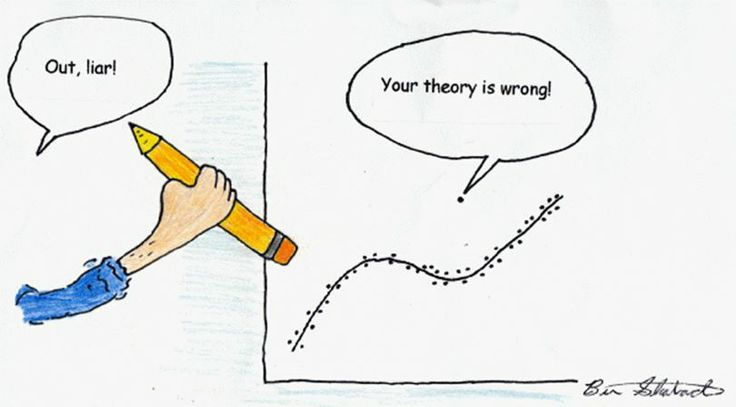
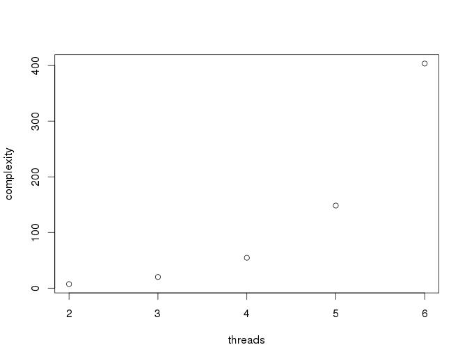

# How did we start?

<!--
Ho do we start developing a platform for real-time automated trading?
-->

----

](./figures/clock_freq.png)

----

<!--
This graphic, taken from the Stanford CPU databse, shows the evolution of the
CPU clock frequencies since 1970.

Does it violate the Moore's law? The answer is no. Modern CPUs are simply not
incremeting the clock frequency but rather increasing the number of cores.

Some of you might have heard this dot yelling "your theory is wrong!", but
you know what we do with those mean dots...

That dot is of course not representative, and it is probably an experiment
taking the CPU temperature close to 0 Kelvin on a lab or something like that.
-->

## Conclusion

> Nowadays you must make use of multiple cores if you want to develop
  performant applications!

<!--
So the conclusion so far is that we must make use of multiple cores in our
applications.
-->

## Relativity (Einstein)

> e = mc^2

- `e`: energy
- `m`: mass
- `c`: speed of light

<!--
Now, let us have a look at a famous equation formulated by Albert Einstein.

In this equation, as I guess you all know, Einstein relates mass and energy,
in which `e` is the energy, `m` the mass and `c` the speed of light.
-->

## Relativity (Hintjens)

> e = mc^2

- `e`: energy (wasted programming)
- `m`: mass (LoC)
- `c`: ~~speed of light~~ concurrency

<!--
In programming, there is a similar equation in which we can relate:

 - the energy as well (the energy wasted programming)
 - the mass (the number of lines of code)
 - and `c` is not the speed of light but rather the concurrency.
-->

----

<!--
This means that the complexity of our project increases exponentially with
the number of threads in our application.
-->

## Concurrency

- Locks
- Semaphores
- Critical sections
- ...

----

Code **fails**. Misterious bugs...

Irreversible disorders...

<!--
And that is because concurrency implies working with locks, semaphores,
critical sections, race conditions, two step dances, etc.

Which at the end results in code failing with misterious bugs that may cause
irreversible disorders as shown in the recorded tape.
-->

## Alternative

> Actor model

- Independent
- Message passing
- `c = 1`

<!--
Is there an alternative? The answer is yes, and it is called the actor model.

In the actor model actors, or agents are:

 - Independent from each other, which means there is no shared memory
 - They communicate with each other with message passing instead
 - achieving a concurrency factor of 1, which is the best case
-->

## Conclusion

> If we want to reduce complexity, we must use message passing to avoid
  concurrency.

<!--
So the conclusion so far is that we must make use of multiple cores in our
application and we must use message passing to reduce complexity.
-->
