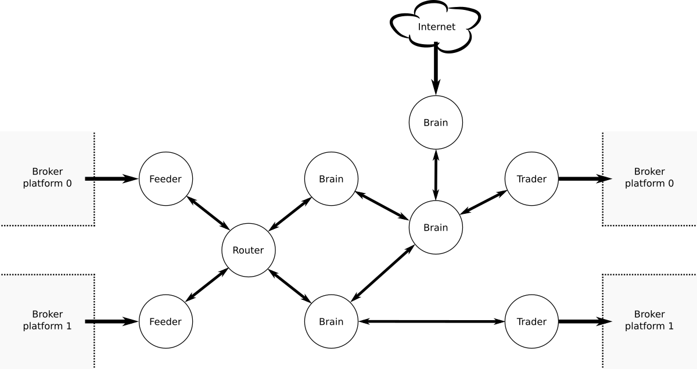
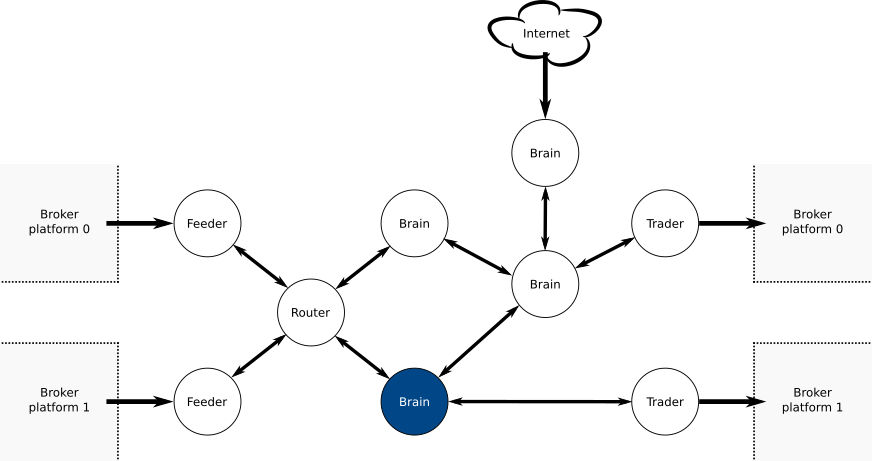
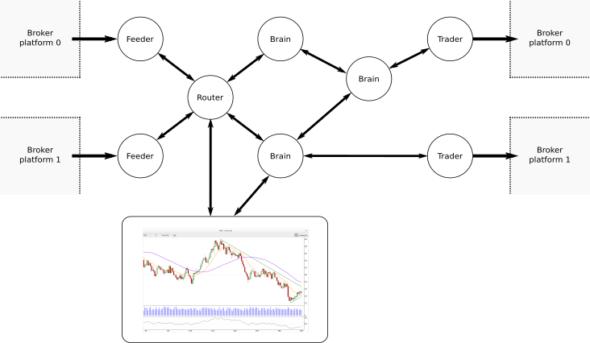
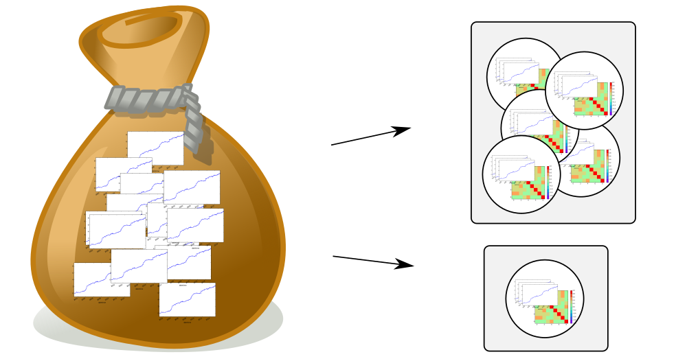

% Python for developing a real-time automated trading platform
% Miguel Sánchez de León Peque
% 2016-04-10

# About

<!--
Hi everyone and thanks for coming to this presentation in which we will talk
about Python for developing a real-time automated trading platform.

Before starting I would like to thank OpenSistemas, the company I have been
working with in this project for letting me come here today and talk about
this project. I hope you like it as much as we do.
-->

<!--
So, a little be about me and about this presentation...
-->

## Us

- [OpenSistemas](http://www.opensistemas.com)
- R&D division
- [Fernando Monera Daroqui](https://www.linkedin.com/in/monera)

<!--
TODO
-->

## Me

- [Miguel Sánchez de León Peque](https://www.linkedin.com/in/peque)
- **Industrial engineer** with background in CS, electronics and control;
   passionate about **programming, statistics and machine learning**
- Met **Python** about 2 years ago

<!--
My name is Miguel Sánchez de León Peque.

I am an industrial engineer with background in computer science, electronics
and control and I feel passionate about programming, statistics and machine
learning.

I met Python about 2 years ago, when I started working with OpenSistemas and,
since then, I have been gradually falling in love with this programming
language, which I currently use in a daily basis.
-->

## This presentation

What it is (not)

<!--
For those of you who have read the abstract of this presentation before coming
here, you already know that ZeroMQ, Pyro, Numpy, Theano, PyQtGraph are mentioned
within it.

However this is not a presentation about any of those tools, but rather a
presentation on why we decided to chose those tools, why we thought they were
suituable for our purpose and how we applied them
to finally implement a real-time automated-trading platform.
-->

# Motivation

<!--
So, first of all, what is the motivation behind this idea and why we wanted
to create this tool?
-->

## Search engine results

- TradeStation
- Metatrader
- NinjaTrader
- Many others...

<!--
If we search for currently available platforms out there, we would find software
like TradeStation, Metatrader, NinjaTrader just to name a few. In fact, there
are a lot of them available for you to choose, each with their own differences.
-->

## Cons

- Propietary
- Heavily desktop oriented
- Linux support?
- Can I use Python to create my strategies?

<!--
However they usually have some caveats in common:

 - They are all propietary.
 - They are usually heavily desktop oriented, many times they cannot even run
   without a graphical interface.
 - And do they have Linux support? Or even non-Windows support? As you can
   imagine, most of them do not.
-->

## What we wanted

- Control
- Optional GUI
- Multiplatform
- Python

<!--
So, what we wanted?:

 - We wanted to have control over our tool. We wanted to have the source code
   and be able to modify it at will.
 - We wanted the GUI to be optional. You may want to display the graphics to
   the user but you may as well simply want to run the system in a remote
   server with no graphical interface.
 - We wanted the software to be multiplatform.
 - And... we wanted Python as well.

Is this possible? We will see...
-->

----

> Is this possible?

# osMarkets

<!--
Now that we know the basics of osBrain, the multi-agent system, we will dive
into osMarkets
-->

## Basics

- **Broker-independent** platform
- Implemented **over osBrain**
- Designed for **real-time automated trading**

<!--
 - osMarkets aims to be a broker-independent platform. In order to make it
   work with a new platform, only a few agents need to be modified.
 - And that is exactly the reason why it is implemented over osBrain.
 - It is designed for real-time automated trading. It must be fast, which it is,
   and it must be robust (we can implement high-availability agents and an
   agent crashing does not result in the whole system stopping... if an agent
   crash, we should be able to notice and recover that agent as soon as
   possible.
-->

## Overview



<!--
Here we can see an overview, a simplified osMarkets architecture in which
we can see that basically we take market data from the broker as input and
then we output the buy/sell orders to the broker platform again.

This is just an osBrain system in which agents are specialized in different
roles.
-->

## Feeder

- Get market data
- Multithread

<!--
- The feeder is an agent whose purpose is to get market data from a broker
  platform. Feeder is a typical multithreaded agent. The main thread, as always
  simply polls for incoming messages, but there are usually two secondary
  threads: one for streaming market tick data which is basically real-time
  updates on the bid/ask prices, the other is for requesting, for example,
  historical market data. Of course those secondary threads communicate with
  the main thread using inproc sockets.
-->

## Overview


## Router

- Broker independent provider
- Stores/distributes
- Update/resample

<!--
 - Router is completely broker independent. Whose purpose is to serve as a
   layer between the feeder, which are broker dependant and the rest of the
   agents.
 - It stores historical market data and distributes updates to the nodes
   interested on those updates.
 - It is also able to update market data with new ticks and resample it to
   create new data based on a different period.
-->

## Market data

- Tick
- Bar
- Bar Series

<!--
Router is able to distribute market data in different forms, so we can
differenciate between:
 - Tick data, which is simply ask/bid price at a particular timestamp,
   implemented as a numpy array.
 - Bar data, which is simply OHLC price during a particular time span or
   period. It is also implemented as a numpy array.
 - Bar Series, which is series of bars, implemented as a numpy ndarray.
-->

## Bar series


<!--
Remember that we are working in real-time, so this series of bars are always
changing.

In order to avoid full memory copies when a new bar is added to the bar series,
we use numpy arrays views to represent the actual bar series we're interested
in. Then this view is pointing to a buffer. So when a new bar comes in, we
add it to the buffer (at the next position), and then update the view. This way
we only need to do a full memory copy once in a while.
-->

## Overview


<!--
We will now have a look at the most common agent, the brain, which is the one
that actually implements the trading strategies.
-->

## Brain

- Subscriptions
- Run algorithms
- Send orders
- Great ecosystem
- Can do anything

<!--
 - Brains can subscribe to router (or market data), but can also subscribe to
   other brains and communicate with them.
 - They run the actual strategies or algorithms.
 - They send market orders to be executed (i.e. buy/sell).
 - And the best thing about them is that, as they are implemented in Python
   and use numpy ndarrays for storing data, they can make use of all the
   available tools in the great Python data analysis and machine learning
   ecosystem. You have got Pandas, Scipy, Scikit-learn, Numba, Theano for
   training artificial neural networks...
 - Basically they can do anything Python can do, which is anything. :-D
   They can also create external connections to the web (for scrapping and
   performing sentiment analysis), or to a database... or whatever you can think
   of.
-->

## Abstraction


<!--
One of the best things of using this kind of architecture is that you can
use a brain hierarchy to abstract market concepts. In the lowest level you'd
have brains that work with raw market data, and as we go up in the hierarchy,
brains start to abstract concepts closer to what the human trader uses when
trading such as: market structure, intention, etc.
-->

## Overview


<!--
And finally, the last agent shown in this overview, which is the trader.
-->

## Trader

- Handle orders
- Multithread

<!--
This agent is similar to the feeder, as it is broker dependent. Its purpose
is to handle orders sent from the brains and handle global positions and
account balance.

It is another case of a multithreaded agent, in which secondary threads
avoid concurrency using inprocess sockets to communicate with the main thread.
-->

## Example



<!--
As an example of how it all works together we can imagine a new brain spawning
and joining the system.

This brain may subscribe to router to get EUR_USD 2 Minutes market data. But
router may not have that data, so it will ask feeder. Feeder may only have
1 Minute data available through the broker API, so it will send 1 M data
back to router, router will resample this data to have 2 minutes period and
then it will send this bar series back to the brain that requested it. From then
it will also start sending updates on that series (either bar updates or tick
updates, depending on the subscription type).

At any point any brain on the right may decide to execute an order, so it will
be sent to trader and trader will take care of it, dealing with the broker.
-->

## Other agents

- Logger
- Informer
- Overmind

<!--
There are other agents that we have not mentioned. Such as:

 - The logger, which can be used to log information, warning, error or
   debug messages sent from any agent.
 - The informer, which can be used to publich information about changes in the
   account balance or the rates at which you can trade your account's currency
   for other currencies.
 - And the overmind, which is a console implemented with Python's `cmd` module
   and lets you easily monitor the state of an osMarkets instance and add,
   remove or modify agents while the system is running.
-->

# GUI

<!--
We have also developed a Graphical User Interface for osMarkets, which is
currently in pre-pre-pre alpha state.
-->

## Features

- Real-time **market data visualization**
- Real-time **indicators visualization**
- **Integration** with osMarkets

<!--
The GUI is useful for real-time market data visualization as well as real-time
indicators visualization.

It behaves as another agent in the system network and is used to visualize
graphics of the market data and strategies that are being executed in real-time
and to manage brains inside the system
-->

## Qt

- Great **portability**
- Probably the **most widely used**
- LGPL

<!--
The GUI is using Qt with Python bindings of course.

Deciding on Qt was simple, as it really has great portability and, most
importantly, it is probably the most widely used out there...

Appart from that it is licensed under the LGPL which might be more appealing
for some projects.
-->

## PyQtGraph

- **Pure Python** graphics library
- **Fast** real-time display
- User **interaction**
- MIT

<!--
But what is most interesting about this GUI is the use of the less-known
PyQtGraph project.

- It is a pure Python graphics library, suitable for real-time display.
- It uses Qt's GraphicsView for fast displaying and can use a GL backtend too
- It implements user interaction with the graphics (zooming, panning...)
- Licensed under the MIT license

-->

## Overview

- [Main Window](./video/gui_main_window.webm)
- [Chart](./video/gui_chart.webm)
- [Indicators](./video/gui_indicators.webm)

<!--
The main window allows us to create new graphics it new tabs or in new
windows as well.

At the same time, it can be used to show the state of osMarkets (brains and
error messages if there were any).

-------------

From the chart window we can also change the symbol/instrument and the period
we are displaying. This will result in a request from the GUI to subscribe to
router to the new market data feed. Router will do its job and get it somehow
and return it back to the GUI.

We can also pause the automatic visual update of the chart to allow the user
zooming in and out in 1 or 2 axes and panning as well.

-------------

From the chart we can also access the indicators menu.

Indicators add extra information superimposed to the market data graphics and
help us interpret the strategies we are executing and the market movements.

When the user accesses the indicators menu in a chart, a new window appears
where indicators can be selected from a list, changing their parameters and
adding them to the chart.

They can also be removed added or modified without the need to remove them
as well.

TODO: diagram (GUI as an agent, what happens when we add an indicator)
-->

## Note



# osBrain

<!--
Let us start with the base part of this tool: osBrain.
-->

## Basics

> A **general purpose** multi-agent system

- Independent agents
- Message passing
- Easy configuration and deployment

<!--
osBrain is a general-purpose multi-agent system written in Python. Agents
are independent from each other and communicate using message passing.
Configuration and deployment is made very easily even for complex architectures.
We will see later how, but for now, let us concentrate on the first part,
which is indepenent agents...
-->

## Other use cases



<!--
In order to perform parameter optimizations, osBrain is being used to execute millions of vectorized [RobinVOL](http://robintradinghub.com/) backtests. Those backtests are then filtered and sent to another osBrain network which perform a portfolio analysis to select the best combination of strategies.

The portfolio analysis is performed in a hierarchical manner. Each agent in the first layer receives a small set of random-selected backtests, and calculates the matrix correlation, drawdown and Sharpe ratio in order to select a small set of strategies among all the ones received: a *miniportfolio*. Those *miniportfolios* are then passed to another layer which receives a smaller number of strategies (filtered by the first layer) and then creates more *miniportfolios* (normally of a bigger size than in the first layer).

This procedure may be repeated in many layers until the last one, which combines all the *miniportfolios* received into a last portfolio with the desired size.
-->

## Processes vs. threads

Have you met GIL?

<!--
When deciding between implementing agents in processes or threads, the
decision is clear. Unfortunately, the most widely used Python interpreters
(CPython PyPy) both have a Global Interpreter Locker, which means that you
would hit performance issues if you use multithreading instead of
multiprocessing.

So, for now, osBrain uses processes instead of threads for running the agents.
This may be changed very easily in the future if the mainstream implementations
get rid of the GIL, which is something that may never happen...
-->

## ØMQ

> ØMQ is very cool -
> If you don't have a project that needs it... ¡create one!

<!--
osBrain uses ZMQ behind the scenes for communications between agents. Why?
Because ZMQ is so cool that if you don't have a project that needs it you
should create one!

That is the main reason, but there are others...
-->

## Why?

- Higher level than raw sockets
- Asynchronous communication
- Multiconnetion (not necessarily one-to-one).
- Multipattern (REQ-REP, PUB-SUB...).
- Multitransport (inproc, ipc, tcp, pgm, epgm).
- Multilanguage (C, C++, Python, Scala, Haskell, Go...).
- Multiplatform.
- Scalable (threads, processes, machines)
- LGPL.

<!--
 - For example, ZMQ provides us with higher level sockets than raw sockets. This
   means we do not have to worry about creating a buffer for receiving parts
   of a message through TCP until the complete message arrives. ZMQ does that
   for us. We just receive complete messages.
 - Communication is asynchronous. Meaning that we can send a message and keep
   doing other stuff. ZMQ will take care of sending that message. With ZMQ
   we can even survive if the server crashes or does not exist yet. The client
   may connect to a remote socket that is not yet binded. ZMQ will wait silently
   until the server is available to deliver the message.

   This is great because
   many times an agent is a client and a server for another agent at the same
   time (because they may have multiple sockets for communication). In this
   case we don't want to worry about which agent should be started first, nor
   about waiting for the server to be available for the client.
 - ZMQ implements multiconnection (communication partterns are not necessary
   1-to-1)
 - It is multipattern (provides us with common communication patterns such as
   request-reply, publisher-subscriber, push-pull)
 - It is multitransport (which means we don't necessarily need to use TCP for
   all communications, we could use inproc for communications between threads,
   ipc for communication between processes or pgm for multicasting). And we
   can very easily change between those transport protocols within our code.
 - It is also multilanguage (ZMQ is a library and, therefore, there are many
   bindings available out there. So your favorite programming language probably
   has already ZMQ bindings available.
 - It is multiplatform, which is a requirement for our system.
 - It is scalable (works between threads, processes, machines...)
 - And it is LGPL.
-->

----


## A basic agent

- Is a system **process**
- Implements methods for easy **binding** and **connecting** with different
  **patterns**
- Activates on **incoming message**
- Mulithreading may be used (*inproc* socket)

<!--
 - A basic agent is, therefore, a system process.
 - It implements methods for easy binding and connecting with different ZMQ
   patterns.
 - It activates on incoming message. Which means that the agens is usually
   polling all the input sockets for new messages. It has a polling time-out
   that allow us to execute custom code when the agent is iddle.
 - The agent can use multithreading, which is very useful in some cases.
   However, all secondary threads (except for the main thread which is polling
   input sockets) should use the `inproc` socket, which is designed for fast
   communication between threads in the same agent and to avoid any shared
   state or concurrency.
-->

## Configuration

> Agents are independent, but they must know the addresses of other agents


- There may be **many sockets**!
- For most agents, assigning a **random address** is simpler

<!--
In order to configure the agents...

We know that agents are independent, but they all need to know the addresses
they are connecting to!

We have to take into account that there may be many sockets! so a configuration
file would be hard and tedious to make...

In fact, for most agents, assigning random addresses to the sockets is much
simpler and works well!
-->

## If only we could...

- Have a **name server**
- Have an **Overmind**...

<!--
If only we could just have something like a name server, which would allow us
to, at least, refer to the agents with a simple name/alias...

Or if only we could have something like an overmind... an entity that is able
to create a whole system while being able to know the addresses where the
agents are binding to...
-->

## Pyro4

- **PY**thon **R**emote **O**bjects
- Treat remote objects as local
- Already has a name server implementation

<!--
And here is where Pyro comes in!

Pyro comes from Python Remote Objects, and this library allows us to treat
remove objects as local.

Pyro can create a server and start serving an object. This object can be
registered in the name server for easy access.

Pyro provides then the user with Proxy objects, which allow you to create
local objects that translate local method calls or attribute access to
remote. So when you execute a method or access an attribute of the proxy, you
are actually running that code on the remote object. Only the call and the
response get automatically serialized and sent between end points.
-->

## A real agent

- Is a system **process**
- This process runs a **Pyro multiplexed server**
- The server serves an actual **Agent object**
- Main thread runs the **main loop** (one-way)
- Other threads allow for **concurrent access for configuration** (*c = 2*)

<!--
Now a real agent looks a little bit different from before.

- It is still a system process,
- But this process runs a Pyro multiplexed server, which ensures proxy calls
  are executed sequencially (avoiding concurrent access between proxies)
- This server serves an actual Agent object, which is the one that is still
  able to bind or connect to sockets and dispatch incoming messages from other
  agents.
- The main thread of the Pyro server runs the main loop of the agent, which is
  polling all input sockets for incoming messages. Note that this is what is
  called a one-way call. This call does not expect a return value and is
  executed in a sepparate thread (out of the multiplexed server).
- Then the other threads in the Pyro server allow for **concurrent** access for
  agent configuration. So concurrency here happens only with the main thread
  and with a single proxy.

It is up to the user to decide which calls are considered safe and which are
not.

- Are you reading?
- Are you writing?
- Can the main thread access the same memory space concurrently?
- Are you using a GIL enabled interpreter (that may help as well)
-->

## Safe calls

```python
def example(self, x):
    self.x = x

def example_safe(self, x):
    self.call_safe('example', x)
```

<!--
When in doubt, you should only call methods that use the `inproc` socket to
make sure only the main thread changes the state of the agent.

In this example we can see a function `example`, which might not be safe, or
we might be unsure, and a function `example_safe`, which simply calls the method
`call_safe` which sends a message through the `inproc` socket so that the main
thread executes the `example` function with parameter `x`.

This is not ideal but it works for our particular case. We may modify Pyro in
the future so that it automatically translate any calls ending with `_safe`
to "safe" calls using the `inproc` socket. Or perhaps, by default, it could
call the safe versions and, if required, call the unsafe versions when the
user adds `_unsafe` to the call.
-->

## Conclusion

- General-purpose multi-agent system with Python
- Independent agents (processes)
- Message passing using ØMQ
- Easy deployment and remote configuration using Pyro4

<!--
In conclusion, we were able to build a general-purpose multi-agent system with
Python. With independen agents (system processes) that communicate with each
other with message passing using ZMQ and with the possibility of easy deployment
and remote configuration using Pyro4.
-->

# Code examples

## An example (I)

```python
from osbrain import random_nameserver
from osbrain import run_agent


def hello_world(agent):
    agent.log_info('Hello world!')


if __name__ == '__main__':

    # System deployment
    ns = random_nameserver()
    agent = run_agent('Agent0', nsaddr=ns)

    # System configuration
    agent.set_method(iddle=hello_world)
```

<!--
Let's have a look at an example here.

We import random_nameserver, which spawns a name server with a random address
and returns a proxy to it.

We also import a run_agent function which does the same, creates an Agent
process and returns a proxy to it.

Then we define a function which simply logs the message 'Hellow world'.

We start with the system deployment: we create the random server and store
the proxy in a variable `ns`. Then we start an Agent with an alias `Agent0`
and we give it the name server address so that it can register itself to it.

Last, we configure the system. Here we simply change the Agent's method `iddle`
to be `hello_world`. By default the iddle message is executed after 1 second
of inactivity, so this will result in a system with a single agent that logs
(prints) the message 'Hellow world' each second.
-->

## An example (II)

```python
from osbrain import random_nameserver
from osbrain import run_agent


def log_message(agent, message):
    agent.log_info('received: %s' % message)


def hello_world(agent):
    agent.log_info('Sending message...')
    agent.send('push', 'Hello, world!')


if __name__ == '__main__':

    # System deployment
    ns = random_nameserver()
    pusher = run_agent('Pusher', nsaddr=ns)
    puller = run_agent('Puller', nsaddr=ns)

    # System configuration
    addr = pusher.bind('PUSH', alias='push')
    pusher.set_method(iddle=hello_world)
    puller.connect(addr, handler=log_message)
```

<!--
In this second example we start by defining two functions. The first one
is a handler for incoming messages. It simply logs the incoming message
received. The second one sends the message 'Hello world' through the socket
named 'push' (which is an alias).

Basically we create a name server, and two agents and then bind the pusher
using the 'PUSH' pattern, creating a socket with an alias 'push'. The socket
address is returned and stored in a variable `addr`.

We then change the iddle method of pusher, so that it sends 'Hello world'
each second over the 'push' socket.

Last, we connect the puller to the address that we got before and set the
handler of this input socket to be `log_message`, so that it logs received
messages.
-->

## An example (III)

```python
from osbrain import random_nameserver
from osbrain import run_agent
from osbrain import BaseAgent


class Push(BaseAgent):
    def on_init(self):
        self.bind('PUSH', alias='push')

    def iddle(self):
        self.log_info('Sending message...')
        self.send('push', 'Hello, world!')

def log_message(agent, message):
    agent.log_info('received: %s' % message)


if __name__ == '__main__':

    # System deployment
    ns = random_nameserver()
    pusher = run_agent('Pusher', nsaddr=ns, base=Push)
    puller = run_agent('Puller', nsaddr=ns)

    # System configuration
    puller.connect(pusher.addr('push'), handler=log_message)
```

<!--
The last example is the same push-pull example as before, but this time
instead of fully configuring the agents remotely, we are creating the pusher
with a custom class.

The Push class inherits from BaseAgent and we simply bind on_init() a PUSH
socket with alias 'push' and then we define the iddle() method to send a
'Hello world' message over this socket.

Note that in this case run_agent() takes a parameter "base" which specifies
the class that is to be used for the base agent (Push in this case).

Then the puller connects to the pusher push address. Note how we call the
`addr` method locally, in the proxy, but it is executed remotely, returning
the address associated with that alias.
-->

## An example (IV)

```python
from osmarkets.brain import Brain
from osmarkets.architecture import OandaArchitecture


class Example(Brain):
    def on_new_bar(self, series):
        # Algorithm
        if series[0].close > series[1].close:
            side = 'buy'
        else:
            side = 'sell'
        # Order
        self.send_order(side=side,
                        size=100,
                        symbol=series.bsid.symbol)


if __name__ == '__main__':

    system = OandaArchitecture(logging=True,
                               account_id=123456,
                               access_token='123abc-345def',
                               environment='live')
    system.stream(['EUR_USD'])

    system.add_brain('example', base=Example)
    system['example'].set_attr(DEBUG=True)
    system['example'].subscribe(('EUR_USD', 1, 'Minutes'), 100)
```

# Final conclusion

----

> ♥ Python ♥

# The end

## References

- [ØMQ](http://zguide.zeromq.org/)
- [Pyro4](https://pythonhosted.org/Pyro4/)
- [PyQtGraph](http://www.pyqtgraph.org/)
- [Numpy](http://www.numpy.org/)

## Contact

[Fernando Monera Daroqui](https://www.linkedin.com/in/monera)
*fmonera@opensistemas.com*

[Miguel Sánchez de León Peque](https://www.linkedin.com/in/peque)
  *msanchez@opensistemas.com*

## Thank you!

- Questions?
- Comments?
- Suggestions?
